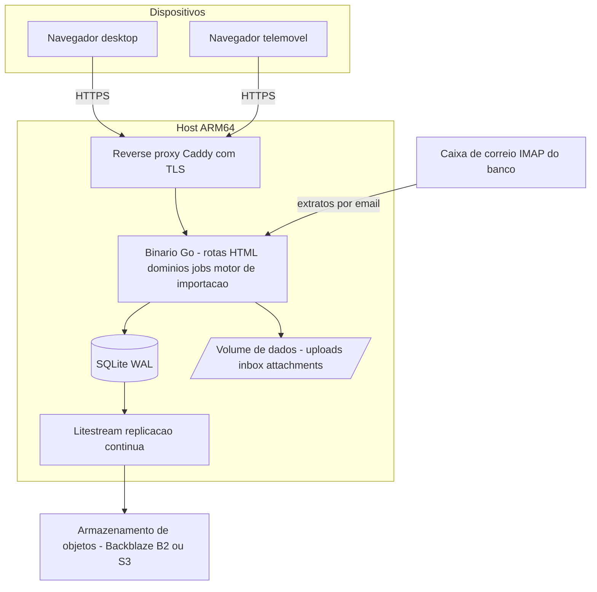
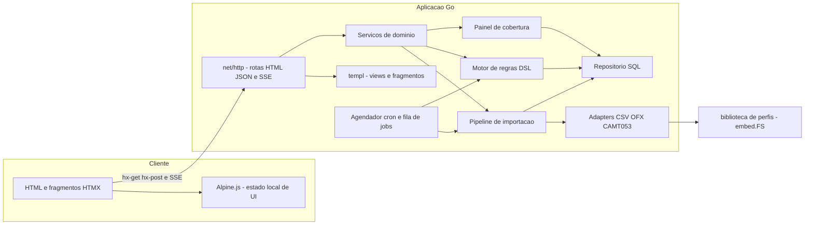
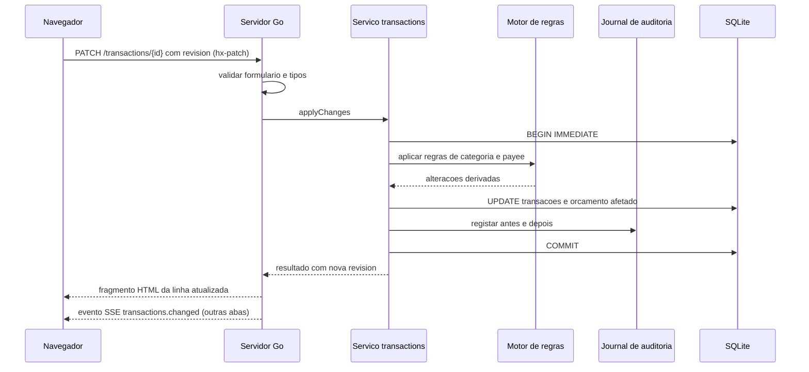
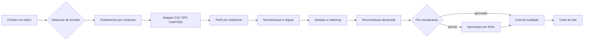

# 01 — Arquitetura

## 1. Contexto

Pretende-se um sistema de finanças pessoais self-hosted com paridade funcional essencial ao Actual Budget, acrescido de um motor de importação CSV que elimine quase todo o trabalho manual de trazer extratos bancários. O sistema roda *full-time* num host ARM64 e é consumido apenas por navegador.

### 1.1 Como o Actual Budget está construído (referência)

Fatos relevantes observados no repositório `actualbudget/actual`:

| Aspeto | Como o Actual faz |
| --- | --- |
| Estrutura | Monorepo Yarn com `loot-core` (lógica de negócio isomórfica), `desktop-client` (`@actual-app/web`, React), `desktop-electron`, `api`, `sync-server`, `crdt`, `component-library`, `plugins-service` |
| Persistência no browser | `@jlongster/sql.js` (SQLite compilado para WebAssembly) a correr num *web worker*, com o sistema de ficheiros virtual persistido em **IndexedDB** |
| Persistência no Node | `better-sqlite3` |
| Importação | `csv-parse` no servidor; mapeamento de campos, deteção de delimitador/linhas de cabeçalho, `flip-amount`, multiplicador, modo in/out, *split mode*, `imported_id` e três camadas de *matching* de duplicados (`matchTransactions`) |
| Sync | Modelo *local-first* com mensagens de CRDT (`packages/crdt`), *clock* e *merkle trie*, sincronizadas contra um `sync-server` Node opcional |
| Regras | Motor de regras declarativo com índices (`RuleIndexer`) sobre `imported_payee`/`payee` |
| UI | React + Redux/Thunk + TanStack Query + Vite + Recharts + `i18next`; fórmulas de objetivos compiladas com **Peggy** a partir de gramáticas `.pegjs` |

### 1.2 Onde nos afastamos

O Actual é *local-first* porque suporta app desktop, offline e sync entre dispositivos com resolução automática de conflitos. Isso traz enorme complexidade: motor de CRDT, *merkle*, mensagens, reparação de sync, três *builds* de plataforma.

O nosso contexto é diferente: **existe sempre um servidor ligado** e **o acesso é só pelo navegador**. Logo, a complexidade de CRDT não se paga. Adotamos um modelo **server-of-record** (ver ADR-001, revisto). O núcleo isomórfico também não se pagou: media-se o ganho de pré-visualização no browser, e mediu-se *depois* que o servidor pré-visualiza 3 000 linhas em menos de 2 s. Era otimização prematura vendida como decisão arquitetural — removida em ADR-012.

---

## 2. Requisitos e drivers arquiteturais

| # | Driver | Implicação arquitetural |
| --- | --- | --- |
| D1 | Host ARM64 modesto, sempre ligado | Um processo e um binário Go; SQLite em vez de PostgreSQL; sem Redis/Kafka; **sem `toolchain` de C no host** (`CGO_ENABLED=0`, `modernc.org/sqlite`); tarefas pesadas em goroutines |
| D2 | Só navegador | HTML renderizado no servidor + HTMX + Alpine.js; responsivo e utilizável em telemóvel; atalhos de teclado |
| D3 | Importação autónoma de **muitas contas e vários cartões** | Pipeline em estágios com *staging* persistido, roteamento por conteúdo, biblioteca de perfis por instituição, cartão como conta, reconciliação de saldo e de totais declarados, *undo* de lote |
| D4 | Dados financeiros sensíveis | TLS obrigatório, *hash* Argon2id, sessões em *cookie* `HttpOnly`/`SameSite`, CSP estrita, acesso privado por VPN/proxy autenticado, backups cifrados, auditoria completa |
| D5 | Correção contabilística | Dinheiro em `int64` (cêntimos), datas civis, transações ACID, reconciliação **obrigatória** na importação, emparelhamento de faturas |
| D6 | Evolução rápida por um único developer | Uma linguagem (Go), UI *server-rendered*, perfis e regras como dados, zero `codegen`, zero `bundler`, zero *framework* de frontend |
| D7 | Recuperabilidade | *Soft delete* + *journal* de auditoria + `undo` de importação; backups contínuos (Litestream) + exportação portável |

---

## 3. Estilo arquitetural

**Monólito modular *server-centric*, com UI renderizada no servidor.**

- **Um processo de aplicação, um binário Go** (`cmd/app`) expõe rotas HTML (fragmentos), rotas REST/JSON de automação, SSE e serve os *assets* estáticos a partir de `embed.FS`. Contém todos os módulos de domínio, com fronteiras explícitas.
- **Um único local para a lógica.** Não existe «a mesma regra no browser e no servidor»: o cliente tem apenas comportamento local de interface (`Alpine.js`) e nenhuma regra de negócio (ADR-012).
- **Os adapters de importação são a única superfície variável**: CSV, OFX e CAMT.053 convergem numa estrutura `RawRow` comum e percorrem o mesmo pipeline a partir do estágio 2 (ADR-013). **PDF está fora de âmbito** (ADR-016).
- **Perfis e regras são dados, não código**: biblioteca de perfis por instituição embutida no binário (`embed.FS`), mais *overrides* do utilizador na base de dados (ADR-006, ADR-015).
- **Sem partilha de base de dados entre módulos**: cada módulo expõe um serviço; acesso direto a tabelas de outro módulo é proibido por convenção e verificado por revisão e por testes que falham se aparecer SQL fora de `internal/data`.

### 3.1 Contexto (C4 nível 1)



### 3.2 Containers



### 3.3 Camadas dentro da aplicação

```
cmd/app/            # main: flags, wiring, arranque           (composição)
internal/
  http/             # rotas HTML e JSON, middlewares, SSE      (transporte)
  views/            # templates templ: layouts, páginas, fragmentos
  modules/          # um diretório por módulo de domínio       (aplicação)
    accounts/  transactions/  budgeting/  payees/  categories/
    rules/     imports/       schedules/  reports/
    coverage/  attachments/   auth/       jobs/
  domain/           # lógica pura, sem I/O                     (domínio)
  adapters/         # csv, ofx, camt053, deteção, roteamento   (aquisição)
  data/             # SQL, repositórios, migrações             (persistência)
  infra/            # sqlite, slog, fila, ficheiros, imap, sse (infraestrutura)
profiles/           # biblioteca de perfis por instituição (embed.FS)
web/static/         # htmx, alpine, css gerado (embed.FS)
migrations/         # ficheiros .sql, apenas para a frente
testdata/           # corpus de fixtures, por instituição e formato
```

Regra de dependência: `http → views → modules → domain`; `modules → data → infra`. `domain` não importa nada de `data`, `infra`, `http` nem `adapters`. `adapters` não escreve na base de dados: produz `RawRow` e devolve ao módulo `imports`.

Consequência prática: **toda a contabilidade e todo o motor de importação são testáveis sem base de dados, sem servidor e sem ficheiros** — o que é o que torna o corpus *golden* rápido e barato de manter.

---

## 4. Módulos de domínio e fronteiras

| Módulo | Responsabilidade | Depende de |
| --- | --- | --- |
| `accounts` | Contas e cartões (`type='credit'`), saldos, reconciliação, datas de fecho, contas *off-budget* | — |
| `transactions` | Transações, splits, transferências, estados *cleared*/*reconciled*, tags, notas | accounts, payees, categories |
| `categories` | Grupos e categorias, ocultação, objetivos | — |
| `budgeting` | Atribuição mensal por envelope, rollover, cálculo de disponível | categories, transactions |
| `payees` | Estabelecimentos, canonicalização, mapeamentos aprendidos | categories |
| `rules` | Regras declarativas de categorização e de importação | payees, categories |
| `imports` | Perfis, lotes, *staging*, *matching*, reconciliação de saldo e de totais, emparelhamento de fatura, *commit*, *undo*, reprocessamento | transactions, rules, payees, accounts |
| `coverage` | Painel de cobertura: o que falta importar, por conta e por mês | imports, accounts |
| `schedules` | Recorrências e projeção de próximas ocorrências | transactions |
| `reports` | Agregações materializadas e consultas analíticas | budgeting, transactions |
| `attachments` | Ficheiros comprovativos e originais de importação | — |
| `auth` | Sessões, *login*, TOTP/*passkey* | — |
| `jobs` | Fila persistida, cron, progresso | imports, schedules |

`reports` **nunca** lê tabelas de `budgeting` diretamente: consome o serviço `budgeting.getMonthSummary()`. Fronteiras verificáveis.

---

## 5. Fluxos principais

### 5.1 Alteração de transações (um único caminho de escrita)



Toda a escrita passa por um *mutator* único que: abre transação, aplica invariantes, executa regras, escreve no *journal*, incrementa a `revision` global e emite evento SSE para as outras abas/dispositivos.

### 5.2 Importação (multi-fonte)

Detalhado em [04-motor-importacao-csv.md](04-motor-importacao-csv.md) (estágios 2 a 7, comuns a todos os formatos) e [07-muitas-contas-e-cartoes.md](07-muitas-contas-e-cartoes.md) (roteamento, cartões, cobertura).

Resumo: `ingestão → deteção de formato → roteamento por conteúdo → parse → perfil → normalização → enriquecimento por regras → deduplicação → reconciliação → pré-visualização → commit reversível`.



### 5.3 Consistência e concorrência

- SQLite: `journal_mode=WAL`, `foreign_keys=ON`, `busy_timeout=5000`, `synchronous=NORMAL`.
- Um único escritor: transações curtas, `BEGIN IMMEDIATE` quando há leitura-e-escrita (evita `SQLITE_BUSY` em *upgrade*).
- Leituras concorrentes ilimitadas em WAL (as abas só leem, e a escrita passa por um único mutator).
- **Concorrência otimista**: cada agregado relevante tem `revision`; as escritas enviam a `revision` lida; divergência devolve `409` com o estado atual para *merge*.
- Importações longas correm numa **goroutine dedicada** e fazem *commit* por blocos de 500 linhas, reportando progresso por SSE. Não existe *event loop* a bloquear — a razão pela qual a concorrência deixa de ser um problema de arquitetura.
- **Zero subprocessos ou binários externos** em todo o *runtime*: sem `poppler`, sem OCR, sem *sidecar* (ADR-016). O binário Go é o único artefacto de execução.

---

## 6. Interface

Duas fronteiras, com regras claras (ADR-004 revisto):

**a) Rotas HTML — o que o utilizador usa.** Devolvem páginas completas ou fragmentos. Não constituem contrato público e podem mudar livremente.

- `GET /accounts`, `GET /transactions?…`, `GET /budget/2026-08`, `GET /imports/{id}/preview`
- `hx-patch`/`hx-post` para edição de célula, aprovação de linhas, filtros e paginação
- Fragmentos pequenos e específicos (`/transactions/{id}/row`) — o que mantém as respostas baratas
- Progresso de *jobs* e eventos por **SSE** em `/events`

**b) REST/JSON — a fronteira de automação.** Versionada em `/api/v1`, estável, para `curl`, `cron`, *scripts* e integrações futuras.

- `GET/POST /accounts`, `GET /transactions`, `POST /transactions/batch`
- `POST /imports` (*upload*, `multipart/form-data`), `POST /imports/{id}/commit`, `POST /imports/{id}/undo`, `POST /imports/{id}/reprocess`
- `GET /imports/profiles`, `GET /coverage`
- `GET /budget/{month}`, `PATCH /budget/{month}/{categoryId}`, `GET /reports/*`
- `POST /jobs`, `GET /jobs/{id}`

Detalhes transversais:

- ***Streaming* para disco** no *upload* (`/data/uploads`) — nunca carregar o ficheiro todo em memória. Aceita CSV, OFX e CAMT.053 indistintamente.
- **Validação** na `struct` do formulário, com erros devolvidos no próprio fragmento HTML. Rotas JSON validam explicitamente e devolvem erro estruturado.
- **Idempotência**: `POST /imports` aceita `Idempotency-Key`; reprocessar o mesmo ficheiro não duplica nada.
- **Erros** com código estável (`BALANCE_MISMATCH`, `DATE_AMBIGUOUS`, `REVISION_CONFLICT`, `CARD_PAYMENT_UNMATCHED`) — o cliente e os testes reagem ao código, não ao texto.
- **Sem OpenAPI gerado**: a superfície JSON é pequena e mantida à mão, com testes que verificam o formato das respostas.

---

## 7. Extensibilidade

**Adapters de importação atrás de uma interface única:**

```go
// internal/adapters
type Adapter interface {
    // ID identifica o formato: "csv", "ofx", "camt053".
    ID() string

    // Detect pontua a confiança de que este adapter sabe ler o ficheiro.
    // magic bytes e amostra de conteúdo; nunca o nome do ficheiro.
    Detect(head []byte) (Score float64, err error)

    // Parse produz linhas cruas. Nunca escreve na base de dados.
    // PageNo é 0 em formatos sem páginas.
    Parse(ctx context.Context, r io.Reader, opts ParseOptions) (iter.Seq2[RawRow, error], error)

    // SuggestProfile propõe mapeamento e opções a partir de uma amostra.
    SuggestProfile(sample []RawRow) (ProfileSuggestion, error)
}

type RawRow struct {
    LineNo int
    PageNo int
    Cells  []string // mesma semântica em todos os formatos
    RawRef []byte   // bytes originais da linha/página, para raw_json
}
```

**Adicionar suporte a uma instituição nova é, no caso normal, editar um ficheiro de perfil** — sem código, sem *deploy*, sem testes novos (ADR-015). Só um formato genuinamente novo justifica um adapter — e PDF não é um deles, por decisão explícita (ADR-016).

- **Regras como dados, não código**: condições e ações em JSON, avaliadas por um interpretador com índices. O utilizador pode editar, exportar e partilhar regras.
- **Sem *plugins* de código no MVP**: não se introduz *sandbox* de execução de código. A extensibilidade vem de dados (perfis, regras, sinónimos), não de binários de terceiros.
- *Adaptadores futuros* (Open Banking: Pluggy, Belvo) entram pela mesma interface, sem tocar no motor.

---

## 8. Qualidade e observabilidade

| Área | Abordagem |
| --- | --- |
| Tipos | Go com tipos explícitos do domínio; `int64` em dinheiro; nada de `float64` |
| Testes unitários | `go test` (padrão); `domain`, `adapters` e `imports` com cobertura alta obrigatória |
| Testes baseados em propriedades | `pgregory.net/rapid` para dinheiro, ordenação, idempotência do *matcher* |
| Testes de regressão de importação | Corpus de ficheiros reais anonimizados por instituição e formato; teste *golden* linha-a-linha |
| Reconciliação declarada | Saldo, totais de compra e contagens declarados pela fonte, verificados contra as linhas extraídas |
| Testes de HTTP | `net/http/httptest`, incluindo *golden* dos fragmentos HTML críticos |
| E2E | Adiado; os fluxos críticos são cobertos por `httptest` + *golden* |
| Lint/format | `golangci-lint` + `gofumpt` + `staticcheck` |
| Vulnerabilidades | `govulncheck` |
| Logs | `log/slog` em JSON, com `requestId` e `batchId` correlacionados |
| Métricas | `/healthz` (sem autenticação, apenas interno) e contadores simples; nada de Prometheus no MVP |
| Auditoria | Journal consultável na UI: quem mudou o quê, quando, e possibilidade de reverter |
| Performance | Orçamento explícito por importação (ver [04 §10](04-motor-importacao-csv.md#10-desempenho-e-operação-em-arm64)) |

---

## 9. Roadmap por fases

| Fase | Entrega | Critério de saída |
| --- | --- | --- |
| **M0 — Fundação** | Módulo Go, migrações, SQLite, `templ` + HTMX + Tailwind, auth de utilizador único, contas e transações manuais, deploy ARM64 com backup | Consigo registar despesas no telemóvel e restaurar a base de dados de um backup |
| **M1 — Paridade essencial** | Categorias e grupos, orçamento por envelope com rollover, payees, transferências e splits, busca e filtros | Fecho mensal completo sem folha de cálculo externa |
| **M2 — Importação V1 + logística** | Adapter CSV genérico, *upload*, pré-visualização, dedupe, *undo* de lote, **roteamento por conteúdo**, **painel de cobertura**, **contas de cartão** | Importo 9 ficheiros numa pasta sem escolher nada, e vejo o que falta importar |
| **M3 — Automação e cartões** | **Biblioteca de perfis por instituição**, reconciliação de saldo, regras de *payee* brasileiras, **emparelhamento de pagamento de fatura**, IMAP, *cron* | A importação mensal exige uma confirmação, e o cartão deixa de duplicar despesa |
| **M3.5 — OFX e CAMT.053** | Adapters diretos com `FITID` e roteamento por `ACCTID`/`IBAN` | Contas com OFX deixam de ter qualquer trabalho manual |
| **M4 — Divisão por cartão e parcelas** | Contas-alvo distintas por linha (titular/adicional), regras de bloco de parceladas | Fatura com adicional importa para duas contas num só lote |
| **M4.5 — Relatórios e recorrências** | Agendamentos, projeção, cash flow, património líquido, despesa por categoria | Visão consolidada anual sem consultas manuais |
| **M5 — Polimento** | Atalhos, anexos, TOTP/*passkey*, exportação portável, tema escuro | Uso diário confortável no telemóvel |

Reordenado em 2026-09-14 para atacar primeiro o que reduz trabalho real: **roteamento, cobertura e cartões antes de mais formatos**, e **OFX antes de qualquer novo adapter**. Justificação em [07 §11](07-muitas-contas-e-cartoes.md#11-fases).

**PDF não tem fase atribuída** — está fora de âmbito ([ADR-016](05-decisoes-adr.md#adr-016--pdf-fora-de-âmbito)). O estudo técnico está preservado em [99-fora-de-ambito-pdf.md](99-fora-de-ambito-pdf.md), caso o tema seja reaberto.

---

## 10. Riscos e mitigações

| Risco | Impacto | Mitigação |
| --- | --- | --- |
| Ambiguidade de data/valor nos CSV brasileiros | Lançamentos errados silenciosos | Deteção estatística + **reconciliação contra a coluna de saldo** como oráculo + confirmação humana de perfil |
| Divergência de saldo por linhas de resumo do banco («SALDO ANTERIOR») | Transações fantasma | Pacote de regras de *ignore* por banco + verificação de continuidade de saldo |
| **Dupla contagem entre fatura de cartão e conta corrente** | Orçamento errado em dois sentidos, silenciosamente | Cartão como conta + emparelhamento exato pelo total declarado; `CARD_PAYMENT_UNMATCHED` como aviso visível (ADR-014) |
| Banco que só exporta PDF | Conta sem detalhe por comerciante | **Aceite por decisão** (ADR-016). Modo «apenas o total» mantém saldos e dívida corretos; esgotar primeiro OFX/CSV escondido no portal |
| Layout do CSV do banco mudar | Ficheiros deixam de importar | Assinatura de perfil + diagnóstico explícito; corrigir no ecrã de perfil, sem novo código |
| Corrupção da base de dados ou do SSD | Perda de histórico | Litestream para armazenamento de objetos + `VACUUM INTO` diário + restic + ensaio de restauro mensal |
| Complexidade a crescer para o nível do Actual | Projeto não termina | Não-objetivos explícitos (secção 11); sem CRDT, sem motor de planilha, sem SPA, sem app desktop |
| Dependência nativa não compilar em ARM64 | Bloqueio de deploy | **Eliminado por construção**: `CGO_ENABLED=0` e `modernc.org/sqlite`. **Sem qualquer binário externo no *runtime*** — consequência do ADR-016 |
| Exposição pública de dados financeiros | Perda de privacidade | Acesso só por VPN (Tailscale) ou proxy autenticado; nunca publicar a porta diretamente |
| O *scope creep* regressar pela porta do frontend | Complexidade sem retorno | Critério 5 do [02](02-stack.md) (tecnologias aborrecidas e populares) + regra explícita: **nenhuma regra de negócio em JavaScript** |

---

## 11. Não-objetivos

Justificados para conter o âmbito — cada um tem ADR correspondente:

1. **App desktop (Electron)** — restrição do projeto é browser.
2. **Motor de CRDT / offline completo** — existe servidor sempre ligado; CRDT custa meses e introduz modos de falha subtis (mensagens perdidas, reparação de sync).
3. **SPA e *framework* de frontend** — HTML no servidor, HTMX para interação, Alpine apenas para estado local de UI. Sem `package.json`, sem *bundler*, sem cliente de API (ADR-012).
4. **Motor de planilha genérico** — substituído por expressões restritas (PEG) para objetivos e por agregações materializadas.
5. **Micro-serviços, Kubernetes, mensageria** — carga de 1 utilizador; um binário resolve.
6. **PostgreSQL** — SQLite em WAL sobra em desempenho e elimina operação; migração isolada no repositório de dados.
7. **Redis/BullMQ** — fila de *jobs* em SQLite é suficiente e não adiciona serviço.
8. **Machine learning em *runtime*** — a aprendizagem por mapeamento de *payee* + regras resolve >90% dos casos sem infraestrutura. `transformers.js` e ONNX avaliados e rejeitados. IA apenas *offline*, como ferramenta de *build* (escada do ADR-006).
9. **Multi-utilizador com permissões** — no máximo membros da família com acesso total; isolamento por *budget* fica para depois.
10. **Sincronização bancária por Open Banking no MVP** — CSV/OFX/CAMT primeiro; adaptadores Pluggy/Belvo ficam para fase posterior (a interface de adapter já os acomoda).
11. **Extração de PDF** — decidido e registado em [ADR-016](05-decisoes-adr.md#adr-016--pdf-fora-de-âmbito). Instituições que só emitem PDF usam o modo «apenas o total». O estudo técnico fica arquivado em [99](99-fora-de-ambito-pdf.md) para que reabrir seja barato, se um dia se justificar.
12. **OCR de documentos digitalizados** — consequência do anterior. Erro elevado em tabelas e ~100 MB de imagem, para um caso de uso marginal.
13. **PWA instalável e aplicação nativa no MVP** — o navegador é suficiente; adiado para M5.
14. **Multi-moeda, anexos complexos, etiquetas configuráveis, i18n e temas no MVP** — âmbito cortado a sério; são ~20 ecrãs, não os ~120 do Actual.
15. **Fork do código do Actual** — referência funcional apenas (ver nota de licenciamento no README).
