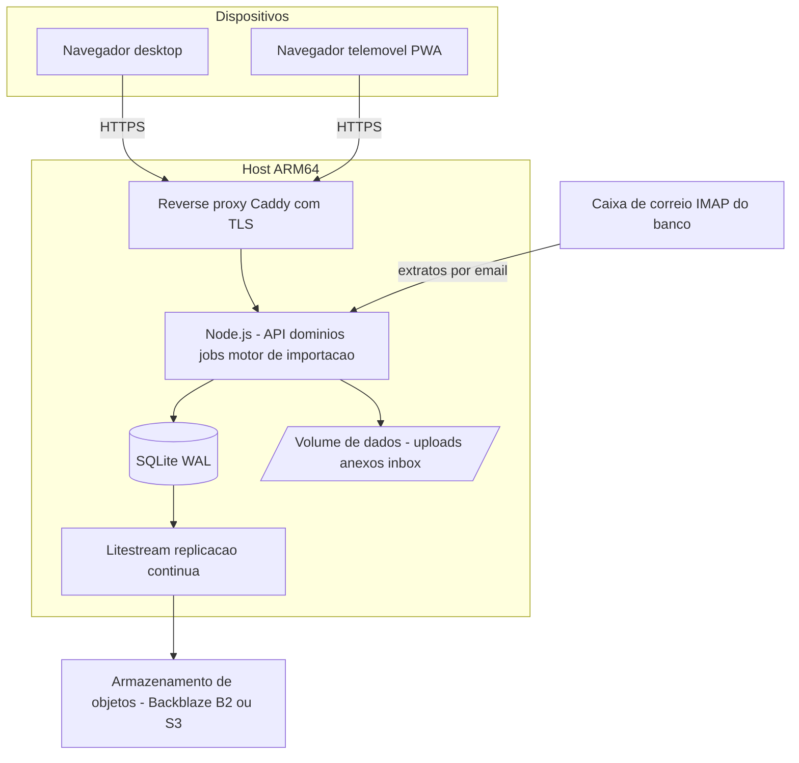
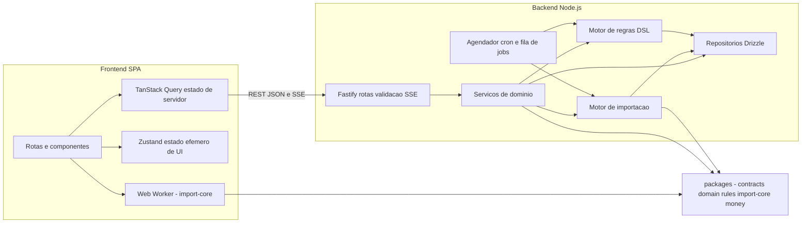
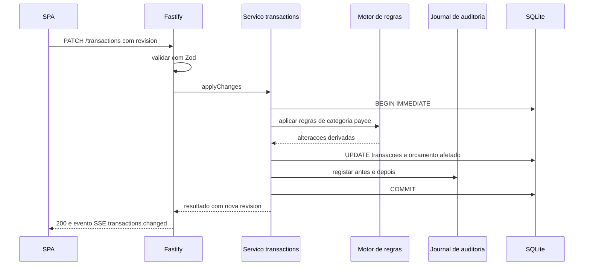

# 01 — Arquitetura

## 1. Contexto

Pretende-se um sistema de finanças pessoais self-hosted com paridade funcional essencial ao Actual Budget, acrescido de um motor de importação CSV que elimine quase todo o trabalho manual de trazer extratos bancários. O sistema roda *full-time* num host ARM64 e é consumido apenas por navegador.

### 1.1 Como o Actual Budget está construído (referência)

Fatos relevantes observados no repositório `actualbudget/actual`:

| Aspeto | Como o Actual faz |
| --- | --- |
| Estrutura | Monorepo Yarn com `loot-core` (lógica de negócio isomórfica), `desktop-client` (`@actual-app/web`, React), `desktop-electron`, `api`, `sync-server`, `crdt`, `component-library`, `plugins-service` |
| Persistência no browser | `@jlongster/sql.js` (SQLite compilado para WebAssembly) a correr num *web worker*, com o sistema de ficheiros virtual persistido em **IndexedDB** |
| Persistência no Node | `better-sqlite3` |
| Importação | `csv-parse` no servidor; mapeamento de campos, deteção de delimitador/linhas de cabeçalho, `flip-amount`, multiplicador, modo in/out, *split mode*, `imported_id` e três camadas de *matching* de duplicados (`matchTransactions`) |
| Sync | Modelo *local-first* com mensagens de CRDT (`packages/crdt`), *clock* e *merkle trie*, sincronizadas contra um `sync-server` Node opcional |
| Regras | Motor de regras declarativo com índices (`RuleIndexer`) sobre `imported_payee`/`payee` |
| UI | React + Redux/Thunk + TanStack Query + Vite + Recharts + `i18next`; fórmulas de objetivos compiladas com **Peggy** a partir de gramáticas `.pegjs` |

### 1.2 Onde nos afastamos

O Actual é *local-first* porque suporta app desktop, offline e sync entre dispositivos com resolução automática de conflitos. Isso traz enorme complexidade: motor de CRDT, *merkle*, mensagens, reparação de sync, três *builds* de plataforma.

O nosso contexto é diferente: **existe sempre um servidor ligado** e **o acesso é só pelo navegador**. Logo, a complexidade de CRDT não se paga. Adotamos um modelo **server-of-record** (ver ADR-001), mantendo a experiência de *preview* local no browser para a importação — o único ponto onde a latência incomoda.

---

## 2. Requisitos e drivers arquiteturais

| # | Driver | Implicação arquitetural |
| --- | --- | --- |
| D1 | Host ARM64 modesto, sempre ligado | Processo único Node; SQLite em vez de PostgreSQL; sem Redis/Kafka; imagem Docker `linux/arm64` com binários pré-compilados; tarefas pesadas em *worker threads* |
| D2 | Só navegador | SPA + PWA instalável; sem Electron; responsivo e utilizável em telemóvel; atalhos de teclado |
| D3 | Importação CSV automatizada | Pipeline em estágios com *staging* persistido, perfis aprendidos por banco, agendamento de importações e *undo* de lote |
| D4 | Dados financeiros sensíveis | TLS obrigatório, *hash* Argon2id, sessões em *cookie* `HttpOnly`/`SameSite`, acesso privado por VPN/proxy autenticado, backups cifrados, auditoria completa |
| D5 | Correção contabilística | Dinheiro em inteiros (cêntimos), datas civis, transações ACID, reconciliação de saldo obrigatória na importação |
| D6 | Evolução rápida por um único developer | Monólito modular, TypeScript ponta a ponta, Zod como fonte única de verdade, zero `codegen` obrigatório |
| D7 | Recuperabilidade | *Soft delete* + *journal* de auditoria + `undo` de importação; backups contínuos (Litestream) + exportação portável |

---

## 3. Estilo arquitetural

**Monólito modular *server-centric*, com núcleo de domínio isomórfico.**

- **Um processo de aplicação** (`apps/server`) expõe HTTP/JSON, SSE e serve a SPA; contém módulos de domínio com fronteiras explícitas.
- **Um pacote de contratos** (`packages/contracts`) define *schemas* Zod usados tanto no servidor (validação de entrada) como no browser (formulários e tipos).
- **Um pacote de núcleo de importação** (`packages/import-core`) é puro e isomórfico: corre no servidor para o *commit* e num *web worker* no browser para pré-visualização instantânea de ficheiros grandes.
- **Sem partilha de base de dados entre módulos**: cada módulo expõe um serviço; acesso direto a tabelas de outro módulo é proibido por convenção e verificado por revisão/lint.

### 3.1 Contexto (C4 nível 1)



### 3.2 Containers



### 3.3 Camadas dentro do backend

```
apps/server/src/
  http/          # rotas, middlewares, serialização, SSE   (transporte)
  modules/       # um diretório por módulo de domínio       (aplicação)
    accounts/  transactions/  budgeting/  payees/
    rules/     imports/       schedules/  reports/
    attachments/ auth/        jobs/
  domain/        # lógica pura, sem I/O (partilhada)        (domínio)
  data/          # repositórios, migrações, mapeadores      (persistência)
  infra/         # sqlite, logger, filas, ficheiros, mail   (infraestrutura)
```

Regra de dependência: `http → modules → domain`; `modules → data → infra`. `domain` não importa nada de `data`, `infra` ou `http`. Isto permite testar toda a contabilidade sem base de dados.

---

## 4. Módulos de domínio e fronteiras

| Módulo | Responsabilidade | Depende de |
| --- | --- | --- |
| `accounts` | Contas, tipos, saldos, reconciliação, contas *off-budget* | — |
| `transactions` | Transações, splits, transferências, estados *cleared*/*reconciled*, tags, notas | accounts, payees, categories |
| `categories` | Grupos e categorias, ocultação, objetivos | — |
| `budgeting` | Atribuição mensal por envelope, rollover, cálculo de disponível | categories, transactions |
| `payees` | Estabelecimentos, canonicalização, mapeamentos aprendidos | categories |
| `rules` | Regras declarativas de categorização e de importação | payees, categories |
| `imports` | Perfis, lotes, *staging*, *matching*, *commit*, *undo* | transactions, rules, payees |
| `schedules` | Recorrências e projeção de próximas ocorrências | transactions |
| `reports` | Agregações materializadas e consultas analíticas | budgeting, transactions |
| `attachments` | Ficheiros comprovativos | — |
| `auth` | Sessões, *login*, TOTP/*passkey* | — |
| `jobs` | Fila persistida, cron, progresso | import, schedules |

`reports` **nunca** lê tabelas de `budgeting` diretamente: consome o serviço `budgeting.getMonthSummary()`. Fronteiras verificáveis.

---

## 5. Fluxos principais

### 5.1 Alteração de transações (um único caminho de escrita)



Toda a escrita passa por um *mutator* único que: abre transação, aplica invariantes, executa regras, escreve no *journal*, incrementa a `revision` global e emite evento SSE para as outras abas/dispositivos.

### 5.2 Importação CSV

Detalhado em [04-motor-importacao-csv.md](04-motor-importacao-csv.md). Resumo: `ingestão → parse → perfil → normalização → enriquecimento por regras → deduplicação → commit reversível`.

### 5.3 Consistência e concorrência

- SQLite: `journal_mode=WAL`, `foreign_keys=ON`, `busy_timeout=5000`, `synchronous=NORMAL`.
- Um único escritor: transações curtas, `BEGIN IMMEDIATE` quando há leitura-e-escrita (evita `SQLITE_BUSY` em *upgrade*).
- Leituras concorrentes ilimitadas em WAL (a SPA só lê).
- **Concorrência otimista**: cada agregado relevante tem `revision`; escritas enviam a `revision` lida; divergência devolve `409` com o estado atual para *merge* no cliente.
- Importações longas correm em *worker thread* e fazem *commit* por blocos de 500 linhas, reportando progresso por SSE — o servidor nunca bloqueia o *event loop*.

---

## 6. API

- **REST/JSON** em `/api/v1` — recursos previsíveis, fácil de testar com `curl` e de automatizar a partir de *scripts* e *cron* (importante para a importação automática).
- **Validação e serialização** com Zod (`fastify-type-provider-zod`), gerando OpenAPI para documentação e cliente tipado.
- **Upload** de CSV em `multipart/form-data` com *streaming* para disco (`/data/uploads`) — nunca carregar o ficheiro todo em memória.
- **SSE** em `/api/v1/events` para invalidação de *cache*, progresso de *jobs* e avisos de *sync*. SSE em vez de WebSocket: mais simples, reconexão nativa, suficiente para o padrão de uso.
- **Idempotência**: `POST` de importação aceita cabeçalho `Idempotency-Key`; reprocessar o mesmo ficheiro não duplica nada.
- **Erros** com código estável (`IMPORT_BALANCE_MISMATCH`, `DATE_AMBIGUOUS`, `REVISION_CONFLICT`) — o cliente reage por código, não por texto.

Endpoints essenciais: `GET/POST /accounts`, `GET /transactions?query=`, `POST /transactions/batch`, `POST /imports` (upload), `POST /imports/:id/preview`, `POST /imports/:id/commit`, `POST /imports/:id/undo`, `GET /imports/profiles`, `GET /budget/:month`, `PATCH /budget/:month/:categoryId`, `GET /reports/*`, `POST /jobs` e `GET /jobs/:id`.

---

## 7. Extensibilidade

- **Adapters de importação** atrás de uma interface única:

```ts
interface BankStatementAdapter<TRaw> {
  id: string;                         // 'csv-generic', 'ofx', 'camt053', 'nubank-csv'
  detect(input: IngestedFile): Promise<DetectionScore>;
  parse(input: IngestedFile, options: ParseOptions): AsyncIterable<RawRow>;
  suggestProfile(sample: RawRow[]): Promise<Partial<ImportProfile>>;
}
```

Adicionar suporte a um banco novo nunca toca no motor: cria-se um adapter e um pacote de regras de normalização de *payee*.

- **Regras como dados, não código**: condições e ações em JSON, avaliadas por um interpretador com índices. O utilizador pode editar, exportar e partilhar regras.
- **Plugins futuros**: os *jobs* e regras são pontos de extensão naturais; não se introduz *sandbox* de execução de código no MVP.

---

## 8. Qualidade e observabilidade

| Área | Abordagem |
| --- | --- |
| Tipos | `strict: true`, sem `any` implícito, Zod como fonte de verdade |
| Testes unitários | Vitest; `packages/import-core` e `domain` com cobertura alta obrigatória |
| Testes baseados em propriedades | `fast-check` para dinheiro, ordenação, idempotência do *matcher* |
| Testes de regressão de importação | Corpus de ficheiros reais anonimizados por banco; teste *golden* linha-a-linha |
| E2E | Playwright no fluxo de importação e de orçamento |
| Lint/format | ESLint + Prettier; `knip` para dependências mortas |
| Logs | `pino` em JSON, com `requestId` e `batchId` correlacionados |
| Métricas | `/healthz` público interno, `/metrics` opcional (Prometheus) com duração de importação, tamanho de WAL, tempo de *commit* |
| Auditoria | Journal consultável na UI: quem mudou o quê, quando, e possibilidade de reverter |

---

## 9. Roadmap por fases

| Fase | Entrega | Critério de saída |
| --- | --- | --- |
| **M0 — Fundação** | Monorepo, migrações, SQLite, auth de utilizador único, contas e transações manuais, deploy ARM64 com backup | Consigo registar despesas no telemóvel e restaurar a base de dados de um backup |
| **M1 — Paridade essencial** | Categorias e grupos, orçamento por envelope com rollover, payees, transferências e splits, busca e filtros | Fecho mensal completo sem folha de cálculo externa |
| **M2 — Importação V1** | Adapter CSV genérico, *upload*, pré-visualização, dedupe por `imported_id` e por data+valor+payee, *undo* de lote | Importo o extrato do mês inteiro em menos de 2 minutos |
| **M3 — Automação** | Perfis aprendidos por conta/banco, *inbox* de ficheiros, polling IMAP, *cron* de importação, reconciliação de saldo, regras de normalização de *payee* brasileiros | A importação mensal passa a exigir apenas uma confirmação |
| **M4 — Relatórios e recorrências** | Agendamentos, projeção, relatórios de cash flow, património líquido, despesa por categoria, idade do dinheiro | Visão consolidada anual sem consultas manuais |
| **M5 — Polimento** | PWA instalável, atalhos, anexos, TOTP/*passkey*, exportação portável, tema escuro | Uso diário confortável no telemóvel |

---

## 10. Riscos e mitigações

| Risco | Impacto | Mitigação |
| --- | --- | --- |
| Ambiguidade de data/valor nos CSV brasileiros | Lançamentos errados silenciosos | Deteção estatística + **reconciliação contra a coluna de saldo** como oráculo + confirmação humana de perfil |
| Divergência de saldo por linhas de resumo do banco («SALDO ANTERIOR») | Transações fantasma | Pacote de regras de *ignore* por banco + verificação de continuidade de saldo |
| Corrupção da base de dados ou do cartão SD | Perda de histórico | Litestream para armazenamento de objetos + `VACUUM INTO` diário + restic + ensaio de restauro mensal |
| Complexidade a crescer para o nível do Actual | Projeto não termina | Não-objetivos explícitos (secção 11); sem CRDT, sem motor de planilha completo, sem app desktop |
| Dependência nativa não compilar em ARM64 | Bloqueio de deploy | Preferir bibliotecas com *prebuilds* `linux-arm64` / binários Go / `node:sqlite`; testar em ARM antes de adotar |
| Exposição pública de dados financeiros | Perda de privacidade | Acesso só por VPN (Tailscale) ou proxy autenticado; nunca publicar a porta diretamente |

---

## 11. Não-objetivos

Justificados para conter o âmbito — cada um tem ADR correspondente:

1. **App desktop (Electron)** — restrição do projeto é browser. Se for preciso, a PWA cobre o caso.
2. **Motor de CRDT / offline completo** — existe servidor sempre ligado; CRDT custa meses e introduz modos de falha subtis (mensagens perdidas, reparação de sync).
3. **Motor de planilha genérico** — substituído por expressões restritas (PEG) para objetivos e por agregações materializadas.
4. **Micro-serviços, Kubernetes, mensageria** — carga de 1 utilizador; monólito modular resolve.
5. **PostgreSQL** — SQLite em WAL sobra em desempenho e elimina operação; migração isolada no repositório de dados.
6. **Redis/BullMQ** — fila de *jobs* em SQLite é suficiente e não adiciona serviço.
7. **Machine learning para categorização** — a aprendizagem por mapeamento de *payee* + regras resolve >90% dos casos sem infraestrutura.
8. **Multi-utilizador com permissões** — no máximo membros da família com acesso total; isolamento por *budget* fica para depois.
9. **Sincronização bancária por Open Banking no MVP** — CSV/OFX primeiro; adaptadores Pluggy/Belvo ficam para fase posterior (a interface de adapter já os acomoda).
10. **Fork do código do Actual** — referência funcional apenas (ver nota de licenciamento no README).
