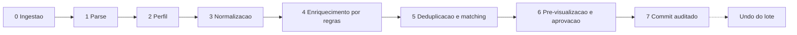
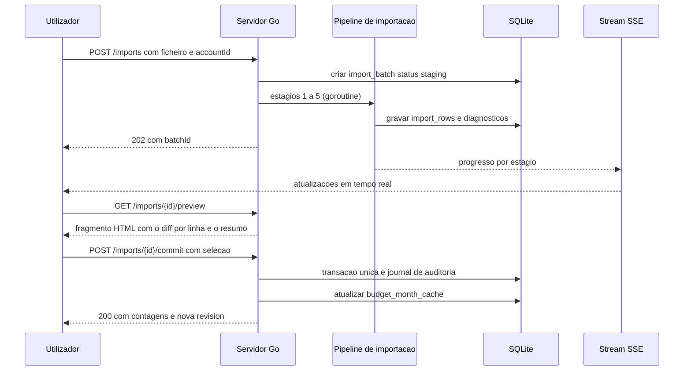

# 04 — Motor de Importação CSV

Este é o diferencial do produto. O objetivo declarado: **a importação mensal deve exigir uma confirmação, não trinta minutos de mapeamento de colunas.**

O Actual já faz um trabalho razoável (mapeamento de campos, deteção de delimitador, três camadas de *matching*). O que aqui se acrescenta é: **perfis persistentes por banco**, **deteção automática determinística**, **reconciliação de saldo como verificação de integridade**, **aprendizagem de categorização** e ***undo* de lote inteiro**.

---

## 1. Vista geral do pipeline



O núcleo (`internal/adapters` + `internal/modules/imports`) corre **exclusivamente no servidor**, em Go. Não existe versão para o browser: a pré-visualização é calculada no servidor e devolvida como fragmento HTML, com progresso por SSE. Isto elimina o *web worker*, o pacote isomórfico e a disciplina de «pureza» que os acompanhava (ver ADR-001 e ADR-012 revistos).

**Este documento descreve os estágios 2 a 7, que são agnósticos ao formato.** CSV, OFX e CAMT.053 convergem no mesmo `RawRow{LineNo, Cells[], RawRef}` e percorrem o mesmo pipeline a partir do estágio 2. As particularidades de cada fonte — roteamento por conteúdo, cartões, faturas e cobertura — estão em [07-muitas-contas-e-cartoes.md](07-muitas-contas-e-cartoes.md). **PDF está fora de âmbito** ([ADR-016](05-decisoes-adr.md#adr-016--pdf-fora-de-âmbito)).



---

## 2. Estágio 0 — Ingestão

Quatro origens, todas convergindo no mesmo registo de lote:

| Origem | Mecanismo | Notas |
| --- | --- | --- |
| Upload manual | `POST /imports` (`multipart/form-data`) | *Streaming* direto para `/data/uploads`, nunca em memória |
| Pasta vigiada | `fsnotify` em `/data/inbox/` (pasta **única**) | Vantagem enorme: largar ficheiros por SMB/Nextcloud e o sistema importa sozinho. O destino é decidido pelo conteúdo, não pelo nome ([07](07-muitas-contas-e-cartoes.md#3-roteamento-automático-por-conteúdo)) |
| Email | `emersion/go-imap` a cada 15 min, filtrando remetente/assunto | Bancos que enviam extrato por email — muitas vezes em **OFX**, que é o melhor caso possível |
| API/CLI | `POST /imports` com `Idempotency-Key`, ou `app import --file` | Integração com automações próprias |
| Reprocessamento | `POST /imports/{id}/reprocess` sobre um lote existente | Não exige novo *upload*: o original está em `uploads/`. Essencial quando o mapeamento do perfil estava errado (ADR-008, [07](07-muitas-contas-e-cartoes.md)) |

Ações imediatas: calcular `file_sha256`, guardar o ficheiro original intacto em `/data/uploads/<ano>/<mes>/`, e criar `import_batches` com `status='staging'`. O original nunca é apagado — é a prova documental de tudo o que foi importado.

Se o mesmo `file_sha256` já existir para a conta com `status='committed'`, o lote é criado com diagnóstico `DUPLICATE_FILE` e não avança.

---

## 3. Estágio 1 — Deteção de formato e *parsing*

Antes de interpretar, identificar o que o ficheiro é: `<OFX`, `<Document` (CAMT.053), ou texto delimitado. Cada formato tem o seu adapter, mas todos emitem a mesma estrutura `RawRow{LineNo, Cells[], RawRef}`. Os passos abaixo são os do adapter CSV — o mais comum e o que está sempre disponível.

Passos, nesta ordem:

1. **Codificação.** Tentar UTF-8 em modo estrito (validação com `utf8.Valid`); se falhar ou produzir caracteres de substituição, degradar para CP1252 e depois ISO-8859-1, com `golang.org/x/text/encoding/charmap`. Deteção com `saintfish/chardet` como heurística de apoio. Registar `ENCODING_FALLBACK` como aviso — não como erro.
2. **Delimitador.** Testar `,`, `;`, tabulação, `|` e `~`. Pontuar pela **consistência** da contagem de campos nas primeiras 20 linhas, respeitando aspas. No Brasil, `;` acompanhado de decimal com vírgula é o caso dominante.
3. **Linhas de preâmbulo.** Contas brasileiras frequentemente emitem cabeçalhos do tipo `Extrato de conta corrente - Agência 1234`, `Período: 01/08/2025 a 31/08/2025`, linhas em branco, e por vezes rodapés com totais. Deteção: para cada uma das primeiras 15 linhas, pontuar «probabilidade de cabeçalho» (proporção de células textuais não numéricas, presença de sinónimos conhecidos, contagem de campos igual ao corpo). A linha melhor pontuada vira cabeçalho e sugere-se `skip_start_lines`.
4. **Leitura.** `encoding/csv` com `FieldsPerRecord = -1` (aceita contagens divergentes), `LazyQuotes = true` (tolera aspas mal formadas vinda dos bancos) e `TrimLeadingSpace`. `skip_empty_lines` é trivialmente obtido ignorando registos vazios. Linhas com contagem de colunas divergente geram `RAGGED_ROW` e são mantidas em *staging*.
5. **Preservação.** Cada linha é gravada em `import_rows.raw_json` exatamente como veio. Onde o *parsing* do ficheiro inteiro não for garantido (aspas malformadas, delimitador dentro de aspas, múltiplos delimitadores), usa-se `csv.Reader.InputOffset()` para recuperar os bytes originais, ou uma máquina de estados própria sobre `bufio.Reader`. Nenhuma transformação destrutiva acontece neste estágio.

---

## 4. Estágio 2 — Identificação do perfil

Objetivo: reconhecer o banco e reutilizar configuração. Zero intervenção a partir da segunda vez.

```
header_signature = sha1( concat( [ normalize(colName) for colName in header ] ) )
   normalize: minúsculas, sem acentos, sem pontuação, trim
```

1. Procurar `import_profiles` por `(account_id, source_format, signature)` → **acerto exato**: aplicar `mapping_json`, `parse_options_json`, `ignore_rules_json` e `payee_rules_json`, incrementar `hits`. Em OFX/CAMT, `signature` é o `ACCTID`/`IBAN`; em CSV, o hash das colunas ([07](07-muitas-contas-e-cartoes.md#3-roteamento-automático-por-conteúdo)).
2. Sem acerto exato, procurar o perfil mais próximo por similaridade de cabeçalho (`strutil` com Jaro-Winkler ou Dice ≥ 0.85) ou por `bank_slug` conhecido → **acerto aproximado**: usar como sugestão e pedir confirmação única.
3. Sem nada, consultar a **biblioteca de perfis embutida** ([ADR-015](05-decisoes-adr.md#adr-015--biblioteca-de-perfis-embutida-no-repositório)) e, se a instituição estiver coberta, aplicar esse perfil.
3. Sem nada: **construir perfil por heurística**:
   - Dicionário de sinónimos por campo, sensível ao português:

     | Campo | Sinónimos aceitos |
     | --- | --- |
     | `date` | data, dt, date, data lançamento, data movimento, data da compra |
     | `amount` | valor, valor r$, montante, quantia, amount |
     | `outflow` | débito, debito, saída, saida, valor débito, d |
     | `inflow` | crédito, credito, entrada, valor crédito, c |
     | `payee` | histórico, historico, descrição, descricao, lançamento, lançamento, memo, detalhes, estabelecimento |
     | `category` | categoria, category |
     | `balance` | saldo, saldo atual, saldo após |
     | `id` | id, fitid, documento, nº documento, identificador, autenticação, id lançamento |

   - Pontuação cruzada: nome da coluna **e** conteúdo das primeiras linhas (data reconhecível por regex, valor numérico, texto longo para payee).
   - Casamento por conteúdo quando o cabeçalho não ajuda (colunas sem nome, ficheiros sem cabeçalho): a coluna com padrão de data consistente é `date`; a coluna com par consistente de sinais opostos é `amount`; a coluna de texto mais longo e mais variado é `payee`.

4. Guardar o perfil proposto. A partir da confirmação humana, ele passa a ser **definitivo** para aquela assinatura e a próxima importação é automática.

---

## 5. Estágio 3 — Normalização

### 5.1 Datas

Formatos suportados: `dd/MM/yyyy`, `MM/dd/yyyy`, `yyyy-MM-dd`, `dd-MM-yyyy`, `dd.MM.yyyy`, `dd/MM/yy`, com e sem hora anexada.

**Ambiguidade** `dd/MM` vs `MM/dd`: se todos os valores de dia observados forem ≤ 12, é ambíguo. Resolução por ordem de confiança:

1. Dica no cabeçalho (`DATA`, `date (dd/mm/yyyy)`) ou no perfil guardado.
2. Contexto regional do ficheiro: decimal com vírgula + delimitador `;` ⇒ pt-BR ⇒ `dd/MM/yyyy`.
3. **Oráculo de saldo**: se existir coluna `saldo`, testar as duas interpretações e escolher a que mantém a coluna de saldo monotonicamente coerente com o acumulado dos valores.
4. Persistir a escolha no perfil e **avisar o utilizador** com o código `DATE_FORMAT_INFERRED`, mostrando as duas leituras possíveis na pré-visualização.

Nunca adivinhar em silêncio: um mês trocado contamina todo o orçamento e é quase invisível depois de gravado.

### 5.2 Valores monetários

Formatos: `1.234,56` (pt-BR), `1,234.56` (en-US), `1234.56`, `1234,56`, `1 234,56` (espaço como milhar), negativos com parênteses `(123,45)`, sufixo `D`/`C`, sufixo `-` (`123,45-`).

Algoritmo:

1. Inferir separador decimal e de milhar pela distribuição de amostras da coluna (por exemplo, o separador que aparece sempre com exatamente 2 dígitos à direita é o decimal).
2. Descartar separador de milhar, sinal, sufixo `D`/`C` e parênteses, reduzindo a um par `dígitos` + `marcas`.
3. **Converter diretamente para `int64` cêntimos, por manipulação de string** — nunca através de `float64`. O parser preenche os centavos com zeros à direita até 2 dígitos e usa `strconv.ParseInt`. `shopspring/decimal` só entra se um dia surgir um caso com mais de 2 casas decimais (cotas de fundos, por exemplo).
4. Se existir **coluna de saldo**, usar a reconciliação (5.4) para desempatar interpretações divergentes.

Armadilha explícita: `float64` em Go é IEEE-754 binário. `123.45 * 100` devolve `12344.999…`. **Nenhuma conversão monetária pode passar por `float64`** — nem numa expressão intermédia, nem num *cast*.

### 5.3 Convenções de sinal

| Convenção | Como se deteta | Tratamento |
| --- | --- | --- |
| Coluna única assinada | Uma só coluna numérica com negativos | Usar o sinal diretamente |
| Colunas débito/crédito separadas | Duas colunas, raramente preenchidas na mesma linha | `amount = inflow - outflow` |
| Coluna de natureza | Coluna com valores `D`/`C`, `Débito`/`Crédito` | Aplicar sinal conforme valor |
| Sinal invertido | Todas as entradas positivas mas saldo a descer | `flip_amount`, sugerido automaticamente pelo oráculo de saldo |
| Multiplicador | Valores em milhares ou centavos | `multiplier`, guardado no perfil |

O `flip_amount` sugerido automaticamente e validado contra o saldo é uma melhoria clara face a ter de o descobrir manualmente.

### 5.4 Reconciliação de saldo (verificação de integridade)

Quando existe coluna de saldo:

```
computed_close = declared_open + Σ amount_cents das linhas aceites
```

Comparar com `saldo` da última linha. Resultados:

- **`ok`** — fecha. Confiança alta em todo o pipeline.
- **`mismatch`** — reportar a primeira linha onde o saldo acumulado divergiu do declarado. Isso localiza com precisão a linha em falta, a linha a mais ou a linha-resumo indevidamente importada. Diagnosticar antes de gravar é imensamente melhor do que descobrir três meses depois.
- **`unavailable`** — sem coluna de saldo; usar verificação de continuidade (intervalo de datas sem buracos suspeitos) e avisar que a conferência é parcial.

### 5.5 Linhas a ignorar

Pacote de regras pré-instalado, específico para extratos brasileiros:

```
SALDO ANTERIOR | SALDO DO DIA | SALDO FINAL | SALDO BLOQUEADO |
SALDO DISPONIVEL | EXTRATO | PERIODO | AGENCIA | CONTA CORRENTE |
TOTAL | RESUMO | LIMITE DISPONIVEL | LIMITE DE CREDITO
```

Sem este filtro, a linha «SALDO ANTERIOR» entra como transação e corrompe o saldo — erro clássico e difícil de identificar.

### 5.6 Normalização de *payee*

Cadeia de transformações, com o original sempre preservado em `imported_payee`:

1. **NFC** normalização Unicode.
2. **Remoção de acentos só para efeitos de correspondência** (`NFKD` + remoção de marcas), preservando a forma original para exibição.
3. **Maiúsculas** e colapso de espaços.
4. **Remoção de ruído bancário** por expressões do perfil:

   ```
   \b\d{6,}\b                      identificadores longos
   \b\d{2}/\d{2}(/\d{2,4})?\b      datas embutidas
   \bPIX\b|\bTED\b|\bDOC\b|\bTRANSF\b|\bTRANSFERENCIA\b
   \bCOMPRA\b|\bDEBITO\b|\bCARTAO\b|\bCREDITO\b|\bPARCELA\s*\d+/\d+\b
   \b\d{2,3}\.\d{3}\.\d{3}\/\d{4}-\d{2}\b    CNPJ
   \b\d{3}\.\d{3}\.\d{3}-\d{2}\b             CPF
   \s+-\s+\p{Lu}{2,}\b             sufixos de cidade
   ```

5. **Extração de semântica**: parcelas (`PARCELA 03/12`) viram metadados anexados às notas; tipos de operação reconhecidos (`PIX`, `BOLETO`, `DEBITO AUTOMATICO`, `TARIFA`, `IOF`, `JUROS`, `RENDIMENTO`, `APLICACAO`, `RESGATE`) viram sugestões de categoria.
6. **Correspondência com `payee_mappings`**: se existir, aplica payee e categoria aprendidos. Senão, criar payee novo a partir do texto limpo, com heurística de apresentação (título de caixa, remoção de sufixos genéricos).
7. **Registar a decisão** em `payee_mappings` para reforçar a confiança futura.

### 5.7 Aprendizagem (o multiplicador de produtividade)

Cada correção humana alimenta `payee_mappings`. Regras de aplicação automática:

| Condição | Comportamento |
| --- | --- |
| `hits >= 3` e `confidence >= 0.85` | Categorizar automaticamente, marcar como `auto` na pré-visualização |
| `hits >= 1` e `< 3` | Sugerir, exigir confirmação |
| `misses >= 2` | Rebaixar confiança, voltar a perguntar |

Após dois ou três meses de uso, a esmagadora maioria das linhas entra já categorizada. Esta é a diferença prática entre «importar» e «importar com trabalho doméstico».

---

## 6. Estágio 4 — Enriquecimento pelo motor de regras

As regras são **dados**, não código. Executam-se no mesmo motor em três *stages*:

```json
{
  "id": "rule-supermercado",
  "stage": "pre",
  "description": "Compras em supermercado",
  "conditions": {
    "op": "and",
    "children": [
      { "field": "imported_payee", "op": "contains", "value": "SUPERMERCADO" },
      { "field": "account_id", "op": "oneOf", "value": ["acc-cartao-1"] }
    ]
  },
  "actions": [
    { "op": "set", "field": "category_id", "value": "cat-mercado" },
    { "op": "rename_payee", "value": "Supermercado" },
    { "op": "set", "field": "cleared", "value": true }
  ]
}
```

Ordem de execução:

1. `pre` — normalização e limpeza (por exemplo, corrigir nomes de payee antes de qualquer outra coisa).
2. `default` — categorização normal, executada também sobre transações inseridas manualmente.
3. `post` — regras que dependem do contexto final (transferências, ajustes de saldo).

Implementação: índice por primeiro caractere do campo textual (à semelhança do `RuleIndexer` do Actual) para evitar avaliar todas as regras em todas as linhas. Com algumas centenas de regras e dezenas de milhares de linhas, isto é a diferença entre milissegundos e minutos.

Ações suportadas: `set` (qualquer campo), `rename_payee`, `map_payee`, `add_tag`, `toggle_cleared`, `toggle_reconciled`, `delete` (com muito cuidado e sempre auditado), `link_transfer`.

---

## 7. Estágio 5 — Deduplicação e *matching*

Camadas conforme a secção 3 do [modelo de dados](03-modelo-de-dados.md#3-estratégia-de-deduplicação): T0 (id exato) → T1 (ficheiro repetido) → T2 (data ±7d + valor + payee similar) → T3 (emparelhamento guloso 1-para-1) → T4 (transferências entre contas).

Otimização importante para ARM64: **não fazer uma consulta por linha**. Carregar para memória, uma única vez, todas as transações da conta no intervalo `[min(data) - 7d, max(data) + 7d]`, indexadas por `(date, amount_cents)` num `Map`. O *matching* passa a ser feito em memória; só as escritas vão à base de dados.

Limiar de similaridade de payee: Jaro-Winkler ≥ 0.85 (`github.com/adrg/strutil`) para fusão automática; entre 0.70 e 0.85, apresentar como «possível duplicado» na pré-visualização e deixar a decisão ao utilizador. Nota de desempenho: `strutil` calcula sobre `[]rune`, pelo que a comparação deve ser antecedida de um corte barato (primeiros N caracteres ou comprimento) para não comparar todos os pares em contas com dezenas de milhares de transações.

---

## 8. Estágio 6 — Pré-visualização

Nada é escrito em `transactions` antes da aprovação (salvo se o perfil tiver `auto_commit` e todos os diagnósticos forem `ok`).

A resposta de pré-visualização contém, por linha:

```go
type PreviewRow struct {
    RowID         string
    LineNo        int
    Status        RowStatus  // new | duplicate | updated | ignored | error
    Normalized    Normalized // Date string, AmountCents int64, Payee, CategoryID *string, Notes *string
    TargetAccountID string   // permite dividir um lote por cartão (ADR-014)
    MatchedTxID   *string
    ChangeSummary map[string]Change // antes/depois, para a UI mostrar o que muda
    Selected      bool       // pré-marcado conforme as regras
    Diagnostics   []Diagnostic // Level error|warn|info, Code, Field, Message
}

type Diagnostic struct {
    Level DiagnosticLevel
    Code  string // código estável: ver lista abaixo
    Field string
    Value string
    Msg   string
}
```

Cada `Code` é um valor de erro tipado com `errors.Is` — a UI e os testes reagem ao código, nunca ao texto da mensagem.

Cabeçalho do *diff*: total de linhas, novas, atualizadas, ignoradas, erros, intervalo de datas coberto, resultado da reconciliação de saldo, e o perfil aplicado (com botão «editar mapeamento»).

A UI oferece três vistas: **Diff** (padrão, focada em decisões), **Tabela** (todas as linhas, com filtros) e **Diagnóstico** (só problemas, agrupados por código). Criar/atualizar o perfil é uma ação da própria pré-visualização, não um ecrã separado.

Códigos de diagnóstico previstos:

```
DATE_AMBIGUOUS          DATE_FORMAT_INFERRED     DATE_UNPARSEABLE
AMOUNT_UNPARSEABLE      AMOUNT_SIGN_INFERRED     DECIMAL_SEPARATOR_INFERRED
ENCODING_FALLBACK       DELIMITER_UNCERTAIN      HEADER_ROW_GUESSED
RAGGED_ROW              DUPLICATE_FILE           DUPLICATE_ROW
MATCH_EXACT_ID          MATCH_FUZZY              MATCH_AMBIGUOUS
TRANSFER_PAIRED         BALANCE_MISMATCH         BALANCE_UNAVAILABLE
IGNORED_SUMMARY_ROW     PAYEE_NORMALIZED         RULE_APPLIED
CATEGORY_LOW_CONFIDENCE PAYEE_CREATED
```

Diagnósticos das fontes adicionais (ver [07](07-muitas-contas-e-cartoes.md)):

```
FORMAT_DETECTED         ROUTED_BY_CONTENT        ROUTING_AMBIGUOUS
LEDGERBAL_PRESENT       RECONCILE_TOTAL_OK       RECONCILE_TOTAL_MISMATCH
RECONCILE_EXPLAINED     SUMMARY_BLOCK_IGNORED    INSTALLMENT_FUTURE_USER
CARD_PAYMENT_MATCHED    CARD_PAYMENT_UNMATCHED   CARD_SECTION_SPLIT
FITID_PRESENT           FITID_MISSING
```

---

## 9. Estágio 7 — *Commit* e *undo*

O *commit* corre numa **única transação** SQLite. Se qualquer coisa falhar a meio, nada é gravado. Sequência:

1. Bloquear o lote (`status: staging → ready`).
2. Revalidar `revision` das transações a atualizar (concorrência otimista); conflito aborta e reporta.
3. Inserir as novas transações e atualizar as fundidas, em blocos de 500 dentro da transação.
4. Escrever no `audit_log` com `action = 'import_commit'`, referenciando o `batchId` e os IDs afetados.
5. Marcar as `import_rows` com `status = 'committed'` e `committed_tx_id`.
6. Atualizar `import_batches` com as contagens e `status = 'committed'`.
7. Recalcular `budget_month_cache` dos meses afetados.
8. Emitir evento SSE `imports.committed` para todas as abas.

**Undo**: reverter o lote consiste em percorrer o `audit_log` daquele `batchId` em ordem inversa dentro de uma nova transação — apagar as transações inseridas (via `tombstone`), restaurar o estado anterior das atualizadas, e marcar `status = 'undone'`. As transações apagadas mantêm `imported_id`, pelo que reimportar depois as recupera corretamente. Um lote revertido deixa de colidir no índice único `ux_batches_file_committed`, e a reimportação passa a ser permitida.

Esta funcionalidade — decidir «importei o ficheiro errado para a conta errada» e desfazer tudo com um clique — é das mais valiosas no uso diário e das mais baratas de implementar, dado o modelo de auditoria já existente.

---

## 10. Desempenho e operação em ARM64

| Cenário | Meta | Estratégia |
| --- | --- | --- |
| Ficheiro de 3 000 linhas | < 2 s até à pré-visualização | Parsing em *stream*, carregamento único da janela de *matching* |
| Ficheiro de 50 000 linhas | < 20 s, UI responsiva | Goroutine dedicada por importação, *commit* por blocos de 500, progresso por SSE |
| Reimportação do mesmo ficheiro | < 200 ms | Corte imediato por `file_sha256` |
| Pré-visualização de 3 000 linhas | < 2 s no servidor | Medição que invalidou a necessidade de pré-visualização no browser |
| Memória | < 150 MB de RSS | Nunca carregar o ficheiro completo; limpar estágios intermédios. `GOMEMLIMIT` controla o coletor |

Escritas: `BEGIN IMMEDIATE` com `synchronous = NORMAL` e `busy_timeout = 5000`. Blocos de 500 linhas equilibram desempenho e granularidade de progresso.

---

## 11. Testes

1. **Corpus de regressão**: ficheiros reais anonimizados de cada banco e cartão (Nubank, Itaú, Bradesco, Banco do Brasil, Caixa, C6, Inter, cartões), versionados em `testdata/fixtures/<instituicao>/<formato>/`. Cada *fixture* tem de vir acompanhada do perfil correspondente — sem perfil, não entra (ADR-015).
2. **Testes *golden* linha-a-linha**: cada *fixture* tem um JSON esperado com datas, valores em cêntimos, payees, categorias e códigos de diagnóstico. Alterações de comportamento aparecem como *diff* revisto em PR. Implementação com `-update` para regenerar e `go-cmp` para comparar.
3. **Testes de propriedades** (`pgregory.net/rapid`):
   - Importar duas vezes o mesmo ficheiro ⇒ zero novas transações (idempotência).
   - Importar as linhas em ordem aleatória ⇒ mesmo resultado final.
   - `parseAmount` e `formatAmount` são inversos para valores dentro do domínio.
   - O *matcher* nunca devolve duas linhas emparelhadas com a mesma transação.
4. **Testes adversariais**: ficheiros com codificação mista, aspas soltas, colunas desalinhadas, ficheiros vazios, apenas cabeçalho, valores com `;` dentro de aspas.
5. **Teste de reconciliação**: *fixture* em que falta uma linha deliberadamente; o motor deve apontar a linha exata da divergência. O mesmo teste deve cobrir a **explicação** da divergência (linha em falta identificada, não apenas «não fecha»).
6. **Invariante obrigatório de reconciliação**: para todo o corpus com totais declarados, `Σ linhas == total declarado` (saldo, compras ou contagem). É o teste que impede que uma alteração no normalizador passe despercebida ([07](07-muitas-contas-e-cartoes.md#9-reconciliação-declarada-não-só-saldo)).

O corpus é o ativo mais valioso do projeto: é o que impede que uma alteração no normalizador quebre silenciosamente o banco de um utilizador. Com Go, corre com `go test ./...` sobre `t.TempDir()` — **sem Docker, sem contentores de teste, sem base de dados externa**.

---

## 12. Evolução prevista

| Fase | Capacidade |
| --- | --- |
| M2 | CSV genérico, upload, pré-visualização, dedupe, *undo* |
| M3 | Perfis aprendidos, *inbox* de ficheiros, IMAP, perfis por banco brasileiro, reconciliação de saldo |
| M3.5 | OFX e CAMT.053 via adapters dedicados (mais fiáveis, trazem `FITID`) |
| M4 | Regras partilháveis, importação automática total com `auto_commit` para perfis validados; divisão por cartão e parcelas |
| M5 | Polimento: atalhos, anexos, TOTP/*passkey*, exportação portável |
| Futuro | *Adapters* de Open Banking (Pluggy, Belvo) por trás da mesma interface |

**Ordem revista em 2026-09-14.** O *inbox* de ficheiros, o painel de cobertura e as contas de cartão sobem para M2/M3 — atacam diretamente o trabalho mensal com muitas contas e cartões. OFX e CAMT.053 entram em **M3.5**: são mais fáceis e mais fiáveis que o CSV, e trazem identificadores estáveis. **Não há fase para PDF** — está fora de âmbito ([ADR-016](05-decisoes-adr.md#adr-016--pdf-fora-de-âmbito)). Detalhe em [07-muitas-contas-e-cartoes.md](07-muitas-contas-e-cartoes.md#11-fases).
