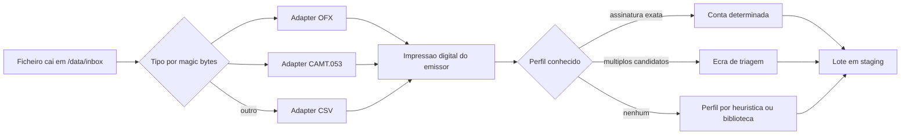
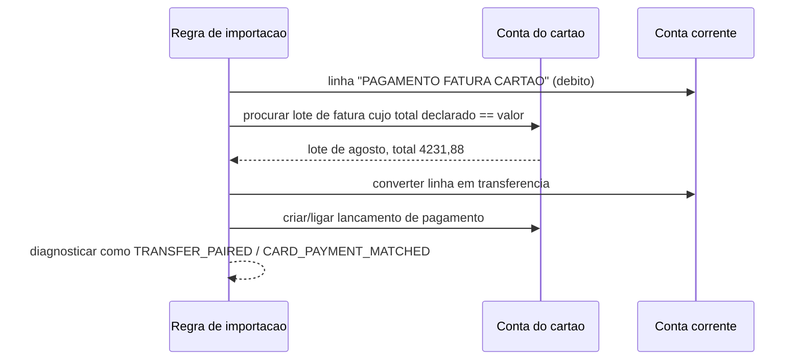

# 07 — Muitas contas e cartões

O motor descrito em [04-motor-importacao-csv.md](04-motor-importacao-csv.md) resolve a *leitura* de um ficheiro. Este documento resolve o problema que motivou o projeto: **ter muitas contas bancárias e vários cartões, e não gastar uma tarde por mês a alimentar o sistema.**

São dois problemas distintos. O primeiro é *parsing*. O segundo é **logística**: encaminhar ficheiros, não contar duas vezes a mesma despesa, e saber que não ficou nada por importar. E é a logística que consome o teu tempo.

**Fontes suportadas: CSV, OFX e CAMT.053. PDF está fora de âmbito** — ver [ADR-016](05-decisoes-adr.md#adr-016--pdf-fora-de-âmbito) e o estudo arquivado em [99-fora-de-ambito-pdf.md](99-fora-de-ambito-pdf.md).

---

## 1. Diagnóstico: onde está o trabalho, de facto

| # | Fricção real | Sintoma no uso do Actual | Solução adotada |
| --- | --- | --- | --- |
| F1 | N perfis para configurar | «Cada conta nova exige mapear colunas outra vez» | **Biblioteca de perfis embutida** (§7) |
| F2 | N ficheiros para entregar | «Tenho de ir a 9 sites por mês» | **Roteamento automático por conteúdo** a partir de uma única pasta (§3) |
| F3 | Dupla contagem cartão ↔ conta | «Comprei no cartão e o valor apareceu duas vezes» | **Fatura como conta própria + pagamento de fatura como transferência** (§4) |
| F4 | Vários cartões na mesma fatura | «Titular e adicional no mesmo ficheiro» | **Divisão de um lote por conta-alvo** (§5.1) |
| F5 | Parcelas e datas de fecho | «A parcela 2/3 aparece na fatura seguinte» | Regras de *ignore* de bloco + janela de *matching* alargada (§5.2) |
| F6 | Incerteza sobre o que falta | «Será que importei tudo este mês?» | **Painel de cobertura** (§6) |
| F7 | Banco que só emite PDF | «Não consigo gerar CSV nem OFX» | **Modo «apenas o total»** (§8) — e ver ADR-016 |

**F3 é a mais grave.** A fatura traz todas as compras; o extrato da conta traz *uma* linha: `PAGAMENTO FATURA CARTAO`. Se ambas entram como despesa, a despesa é contada duas vezes e o orçamento fica errado nos dois sentidos — silenciosamente.

**F1, F2 e F6 são pura logística**: resolvem-se com dados e automação, não com inteligência. São também as que mais tempo te devolvem por hora de trabalho investida.

---

## 2. Fontes suportadas: esgotar o *upstream* antes de desistir

| Degrau | Fonte | Fiabilidade | Custo de implementação |
| --- | --- | --- | --- |
| 1 | **OFX** | Máxima — traz `FITID` (identificador único do lançamento) e `ACCTID` (identifica a conta) | Adapter pequeno |
| 2 | **CAMT.053** | Máxima idem, via `IBAN` e `AcctSvcrRef` | Adapter pequeno |
| 3 | **CSV do portal** | Alta — o núcleo do projeto | Já é o foco |
| 4 | **Anexo de email (IMAP)** | Alta — muitas vezes é OFX, e o utilizador nem sabe | Adapter IMAP já previsto |
| 5 | ~~PDF~~ | — | **Fora de âmbito (ADR-016)** |
| 6 | ~~Agregador (Pluggy, Belvo)~~ | — | **Descartado por custo (ADR-021).** API paga com preço de mercado, incompatível com uso pessoal. Verificado em uso real: o próprio autor tentou usar o Actual com o Pluggy e abandonou pelo custo |

**Consequência prática do degrau 6 descartado:** a única via de entrega automática que resta é o **degrau 4 (IMAP)** — que é gratuita e cobre a parte dos bancos que envia extrato por email. Para os restantes, o download manual continua a existir, e é por isso que o desenho do `/data/inbox` (§3) importa tanto: reduz nove downloads a nove descargas para a mesma pasta.

### 2.1 Checklist de esgotamento do *upstream*

Antes de aceitar que uma conta «só tem PDF», verificar:

1. **OFX/CAMT no portal**, inclusive em ecrãs secundários («Extratos» → «Outros formatos») e na versão desktop do site — a versão móvel muitas vezes esconde a opção.
2. **Email do banco**: pode já estar a receber OFX ou CSV como anexo, ignorado.
3. **O cartão tem exportação separada?** Frequentemente tem, mesmo quando o extrato da conta não tem.
4. **A fatura tem exportação em CSV/OFX?** Muitas fintechs e bancos médios têm; cartões de varejo normalmente não.

Este exercício é feito **uma vez por instituição** e o resultado fica na tabela de conhecimento (§7.3). Um OFX encontrado elimina 100% do trabalho daquele banco para sempre — é o melhor retorno de todo o projeto, e cada hora aqui vale mais do que qualquer linha de código.

### 2.2 Tabela de conhecimento por instituição

Ficheiro versionado `profiles/institutions.yaml`, preenchido uma vez e consultável na UI:

```yaml
- slug: itau
  name: Itaú
  sources:
    checking:  { format: ofx, how: "Portal > Extratos > OFX" }
    credit:    { format: csv, how: "Fatura > Exportar" }
- slug: cartao-exemplo
  name: Cartão Exemplo
  sources:
    credit:    { format: none, how: "Só app, sem exportação", fallback: total_only }
  notes: "Exportação inexistente. Usar modo «apenas o total» (ADR-016)."
```

Serve de documentação para ti e de configuração para o motor. Quando um banco passar a exportar OFX, é uma linha a mudar.

---

## 3. Roteamento automático por conteúdo

**Problema:** entregar 9 ficheiros por mês, cada um à conta certa, sem escolher nada.

**Decisão:** uma única pasta `/data/inbox/` (montada por SMB/Nextcloud/Syncthing). O serviço de ingestão decide o destino pelo **conteúdo**, nunca pelo nome do ficheiro — nomes de ficheiros de bancos são ilegíveis e inconsistentes.



**Impressão digital do emissor** — por formato:

| Formato | Impressão digital | Robustez |
| --- | --- | --- |
| **OFX** | `<FI><ORG>` + `<ACCTID>` | Máxima — identificação exata da conta |
| **CAMT.053** | `<IBAN>` / `<AcctId>` | Máxima |
| **CSV** | `signature` = hash das colunas normalizadas | Alta |

`ACCTID` e `IBAN` são guardados em `accounts.external_account_id` na primeira importação: a partir daí o roteamento é uma **associação direta**, não uma heurística. É a diferença prática entre «o sistema reconheceu este ficheiro» e «o sistema achou que reconheceu».

**Ecrã de triagem.** Quando há candidatos múltiplos, o ficheiro *não* é recusado: entra em *staging* pré-associado e a UI pergunta uma vez, com pré-visualização («Isto parece o extrato do Itaú de agosto, conta 1234 — confirmar?»). A resposta alimenta o roteamento futuro. **Nunca há um passo obrigatório de escolha manual na segunda vez.**

**Idempotência.** `file_sha256` é a primeira barreira: arrastar duas vezes o mesmo ficheiro é inócuo.

---

## 4. Cartões: fatura como conta, pagamento como transferência

### 4.1 O modelo

Cada cartão é uma **conta** com `type = 'credit'` (modelo do Actual, e existe por boa razão):

- Compras na fatura → **negativas** na conta do cartão.
- Pagamento da fatura, vindo da conta corrente → **positivo** na conta do cartão e negativo na conta corrente, ligados por `transfer_id`.
- O saldo do cartão é uma **passividade**: entra no património líquido com sinal negativo.

Sem isto, não há forma correta de representar dívida de cartão.

### 4.2 O erro que isto resolve

Na conta corrente aparece **uma** linha: `PAGAMENTO FATURA CARTAO 4.231,88`. Se for tratada como despesa — e as compras do cartão também foram importadas — a despesa é contada duas vezes. É exatamente o cenário com vários cartões, e é a causa mais provável do trabalho extra que sentes no Actual.

### 4.3 Emparelhamento automático (*fatura matcher*)

Aqui há uma vantagem enorme: **o valor do pagamento é conhecido e exato** — é o total da fatura, que o próprio documento declara. Não é preciso heurística *fuzzy*.



Ordem de tentativa:

| Prioridade | Critério | Resultado |
| --- | --- | --- |
| 1 | Total declarado de uma fatura do cartão == valor do débito | Transferência automática, confiança alta |
| 2 | Soma dos lançamentos do cartão no ciclo == valor | Transferência automática |
| 3 | Payee contém `FATURA`/`CARTAO` + conta de cartão candidata única | Sugerir na pré-visualização |
| 4 | Nada | Manter como despesa **e avisar**: `CARD_PAYMENT_UNMATCHED` |

A regra é configurável por perfil e a decisão é sempre visível na pré-visualização. O `imported_id` do pagamento passa a ser o `batch_id` da fatura emparelhada, o que torna o emparelhamento estável e idempotente: reprocessar não cria uma segunda transferência.

O mesmo mecanismo serve `RESGATE`/`APLICACAO` entre conta corrente e investimento.

---

## 5. Uma fatura, vários cartões; parcelas; datas de fecho

### 5.1 Divisão de um lote por conta-alvo

Faturas com titular e adicional trazem a distinção do cartão — por **coluna** («cartão final», «final 1234») em CSV/OFX, ou por **secção** em alguns formatos. Um único ficheiro deve produzir lançamentos em **duas ou mais contas**.

- `import_rows` ganha `target_account_id`.
- O perfil define `section_rules` que reconhecem a marca do cartão e mudam a conta-alvo das linhas seguintes.
- A pré-visualização agrupa por cartão, com subtotais por secção; a soma dos subtotais tem de fechar com o total declarado.
- Um lote pode, portanto, ter contas-alvo distintas — mas continua a ter **um único *commit* e um único *undo***.

### 5.2 Parcelas

Uma compra em 3× gera três linhas em três faturas, mesma descrição, valores iguais (ou distribuídos), datas a ~30 dias. Consequências:

- A janela de *matching* T2 (±7 dias) já não as funde indevidamente — correto.
- Alguns emissores incluem no ficheiro um **bloco de resumo das compras parceladas**, com o total das competências futuras. Esse bloco **não** é lançamento e tem de estar em `ignore_rules_json`; caso contrário a reconciliação de total nunca fecha. É a causa mais frequente de «não fecha» em faturas.
- `Parcela 2/3` é extraído para metadados e mostrado na nota.

### 5.3 Datas de fecho e deslocamento entre faturas

Faturas fecham a meio do mês e transações podem migrar entre ciclos (compra na véspera do fecho). Mitigações:

- T2 com janela alargada para contas do tipo `credit` (sugestão: ±10 dias).
- `FITID` do OFX quando disponível — resolve o problema por completo.
- Preferência pelos dados do ficheiro mais recente em `date`/`amount_cents` (regra já definida no modelo de dados).

Não se inventa nada novo aqui — apenas se afina o limiar por tipo de conta.

---

## 6. Painel de cobertura — «importei tudo este mês?»

Responde à ansiedade mais concreta do uso mensal, com dados que já existem.

**Fonte de dados:** `import_batches.period_start`, `period_end`, `status`, `balance_check`; `accounts.closed`; `accounts.closing_day`.

**Apresentação:** matriz `contas × últimos 12 meses`.

| Estado | Significado visual |
| --- | --- |
| ✅ fechado | Lote `committed` cobre o mês e a reconciliação fechou |
| ⚠️ parcial | Lote importado mas `balance_check = 'mismatch'` ou `'unavailable'` |
| ⬜ sem dados | Nenhum lote cobre o mês |
| ⏳ em curso | Mês corrente, fatura ainda não fechou |

**Alertas derivados** (baratos e de altíssimo valor):

- «Conta Itaú: último extrato cobre até 30/06 — julho e agosto em falta.»
- «Cartão C6: fatura de agosto não importada (fecho ao dia 28).»
- «Banco Exemplo: 3 ficheiros em *staging* por aprovar há 5 dias.»
- «Há 2 pagamentos de fatura por emparelhar — falta importar as faturas correspondentes.»

Isto transforma «9 contas × 12 meses = 108 verificações mentais» numa lista de 3 pendências.

---

## 7. Biblioteca de perfis embutida

### 7.1 Decisão

Perfis são **dados versionados no repositório** (`profiles/*.yaml`, embutidos via `embed.FS`), não configuração criada do zero por ti. Aplicação direta do princípio «regras e perfis como dados» (ADR-015).

Cada perfil traz: assinatura de deteção (CSV/OFX/CAMT), mapeamento, opções de *parsing*, regras de `ignore`, limpeza de *payee*, códigos de tipo de operação, `section_rules` (cartões) e expressões dos totais declarados.

### 7.2 Efeito prático

| Instituição | Sem biblioteca | Com biblioteca |
| --- | --- | --- |
| Já suportada | 10–20 min a mapear colunas | **0 min** — deteção automática |
| Nova, com OFX | 15–30 min (a maior parte é descobrir a exportação) | 5 min |
| Nova, só CSV | 20–40 min | 10–15 min, uma só vez |

Com ~20 instituições brasileiras cobertas, a esmagadora maioria das tuas contas cai no caso «0 minutos». **É a resposta mais direta à tua queixa e o item com melhor retorno de todo o roadmap.**

### 7.3 Contribuição

Formato aberto e documentado, para poder ser partilhado pela comunidade (mesmo espírito do ADR-006: regras exportáveis e partilháveis). **Perfis sem *fixture* de teste anonimizada não entram.**

---

## 8. Modo degradado: «apenas o total»

Para uma instituição que não exporta nada — sem CSV, sem OFX, sem CAMT — existe sempre uma saída que não exige adivinhar nem trabalhar:

**Importar apenas o total.** Uma única transação na conta (fatura do cartão ou saldo do extrato), com nota descritiva e o valor que o próprio documento indica.

| Vantagem | Nota |
| --- | --- |
| Zero risco de dados errados | Não há extração, logo não há erro de extração |
| Saldos, dívida do cartão e património ficam corretos | Que é o que importa para o fecho do mês |
| Sem trabalho manual por lançamento | Um lançamento por mês, por conta |
| Consistente com o *fatura matcher* | Continua a emparelhar o pagamento pelo valor exato |

**Limitação aceite explicitamente:** perde-se o detalhe por comerciante e a categorização automática nessa conta. O orçamento por categoria fica incompleto nessa conta, ainda que os totais estejam certos. É uma troca consciente: melhor um total correto do que dez linhas erradas.

**Nota de reversibilidade.** O ficheiro original fica guardado em `/data/uploads`; se um dia a instituição passar a exportar (ou se o PDF voltar ao âmbito — ver [99](99-fora-de-ambito-pdf.md)), o lote pode ser reprocessado e as linhas detalhadas substituem o total, sem perder o histórico.

---

## 9. Reconciliação declarada (não só saldo)

Já descrita em [04 §5.4](04-motor-importacao-csv.md), mas generalizada: **usar todos os números que a fonte declara como invariantes.**

| Verificação | Onde existe | Expressão |
| --- | --- | --- |
| Saldo | Coluna `saldo` em CSV; `<LEDGERBAL>` em OFX | `declared_open + Σ linhas == declared_close` |
| Totais | Linhas-resumo em CSV; `<AVAILBAL>` em OFX | `Σ linhas de compra == declared_purchases` |
| Contagem | Alguns formatos declaram o nº de lançamentos | `nº de linhas == declared_count` |

Divergência gera **explicação acionável**, não apenas «não fecha»: linha em falta, linha duplicada, linha-resumo indevida, sinal invertido ou bloco de parceladas incluído. A busca por subconjunto limitada a 1–2 elementos é `O(n)` e instantânea.

**Regra:** um lote só tem `auto_commit` se a reconciliação fechar e não houver diagnósticos de nível `error`.

---

## 10. Testes

Três tipos de *fixture*, todos com perfil obrigatório a acompanhar:

| Tipo | Conteúdo | Verificação |
| --- | --- | --- |
| CSV | Extratos reais anonimizados por instituição | *Golden* linha a linha |
| OFX/CAMT.053 | Idem, com `FITID`/`AcctSvcrRef` | *Golden* + reconciliação `LEDGERBAL` |
| Adversarial | Codificação mista, aspas soltas, colunas desalinhadas, ficheiro vazio, só cabeçalho, `;` dentro de aspas, bloco de parceladas | Deve produzir diagnóstico explícito — nunca resultado silenciosamente errado |

**Teste de regressão do *fatura matcher*:** pagamento de fatura com valor igual ao total declarado tem de produzir exatamente uma transferência, e reimportar a fatura não pode criar uma segunda.

**Teste do painel de cobertura:** um mês em falta tem de aparecer como pendência, e um mês fechado com `mismatch` como aviso, não como concluído.

---

## 11. Fases

A ordem canónica do roadmap está em [01](01-arquitetura.md#9-roadmap-por-fases) §9 e é ordenada por minutos devolvidos ao utilizador (ADR-018). Aqui fica só o que este documento entrega, por fase:

| Fase | Entrega desta área | Critério de saída |
| --- | --- | --- |
| **M2** | **Roteamento por conteúdo** + contas de cartão (`type='credit'`) + **fatura matcher** + reconciliação declarada + **painel de cobertura** + contas-alvo distintas por linha | Largo 9 ficheiros numa pasta sem escolher nada, o cartão deixa de duplicar despesa, e vejo o que falta importar |
| **M3** | **Biblioteca de perfis** + regras de *payee* brasileiras + aprendizagem de categoria | A instituição coberta deixa de exigir configuração, e a categorização converge para zero |
| **M3.5** | **OFX e CAMT.053** (`FITID`, roteamento por `ACCTID`/`IBAN`) | Contas com OFX deixam de ter qualquer trabalho manual |
| **M4** | Parcelas e blocos de resumo das compras parceladas | O bloco de parceladas deixa de impedir a reconciliação de fechar |
| **M4.5** | **IMAP** (entrega automática) + `auto_commit` por perfil | Nas contas cobertas, o mês passa sem *download* manual |

**Nota de âmbito:** não há fase para PDF. O estudo está preservado em [99](99-fora-de-ambito-pdf.md) e reabri-lo exige uma decisão nova.

**Nota de âmbito:** não há fase para agregadores de extratos (Pluggy, Belvo). Descartados por custo — [ADR-021](05-decisoes-adr.md#adr-021--agregadores-de-extratos-descartados-por-custo). A entrega automática é o IMAP, e não se reserva nada no esquema para uma futura integração.

---

## 12. Riscos específicos desta área

| Risco | Impacto | Mitigação |
| --- | --- | --- |
| **Dupla contagem entre fatura de cartão e conta corrente** | Orçamento errado em dois sentidos, silenciosamente | Cartão como conta + emparelhamento pelo total declarado; `CARD_PAYMENT_UNMATCHED` como aviso visível (ADR-014) |
| Bloco de parceladas confundido com lançamentos | Reconciliação nunca fecha | `ignore_rules_json` no perfil + diagnóstico específico |
| Banco muda o layout do CSV | Ficheiros deixam de importar | Assinatura de perfil + diagnóstico explícito; corrigir o mapeamento no ecrã de perfil, sem novo código |
| Banco que só emite PDF e recusa OFX | Conta sem detalhe | Modo «apenas o total» (§8); modo degradado consciente |
| Instituição nova sem perfil na biblioteca | Trabalho de configuração | É o caso que a biblioteca existe para reduzir; contribuir de volta quando resolvido |
| Acumulação de *staging* por aprovar | Lotes esquecidos, cobertura ambígua | Alerta no painel de cobertura a partir de 3 dias |
